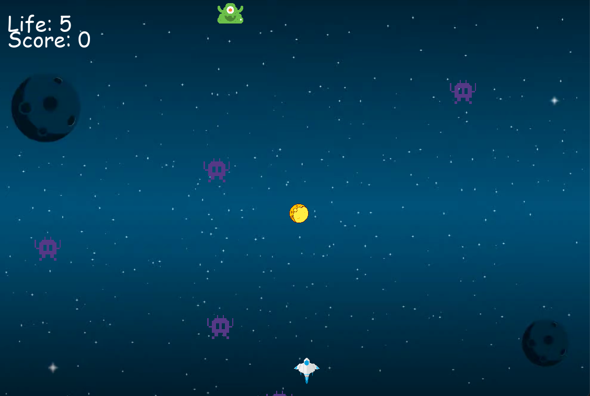

# Space invader

Just playing and learning [pygame](pygame.org), I decide to create
my own game to shown it in action.

# How to play

Install required libraries

    $ pipenv install -r requirements.txt

start the play with the command:

    $ python3 main.py 

or

    $ pipenv shell 
    $ pipenv run python main.py

# Keyboard shortcuts

    left: left arrow
    right: right arrow 
    up: up arrow
    down: down arrow
    fire: space bar

